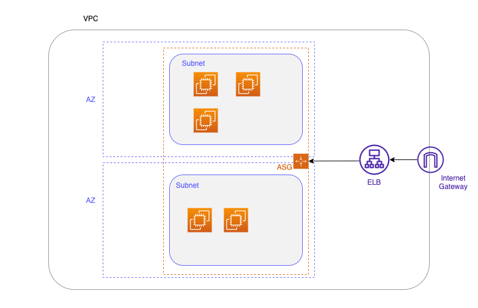

# TerraformChallenge

# Terraform Coding Challenge

Challenge: Deploy a Highly Available Web Application Architecture on AWS

## Challenge

## Objective:

We are providing a Terraform script to deploy a simple, highly available web application architecture on AWS. The architecture includes the following components:

1. VPC with at least two public subnets in different Availability Zones (AZs) to ensure high availability.
2. EC2 Instances, distributed across the two public subnets.

## Architecture Diagram
Create an architecture Diagram like the folowing, showing your solution

## Deliverable:

A Terraform script/plan that can be executed to create the described infrastructure from scratch.

## Instructions:
* We will share this repository live with the candidate
* After reviewing the code, and executing the plan (with errors) we will ask the candidate to troubleshoot the situation with minimal input from our side
* Next, we will request the candidate to submit new code, following certain ideas
* * Add an new resource (ec2, etc)
* * Output a value from one resource to another (example> name)
* * Create an ASG from the instances
* * Create a module for the ASG
* The current code is set up as a example, but is not is a working state. We will fix it or create our own as needed.
* Focus on best practices.

